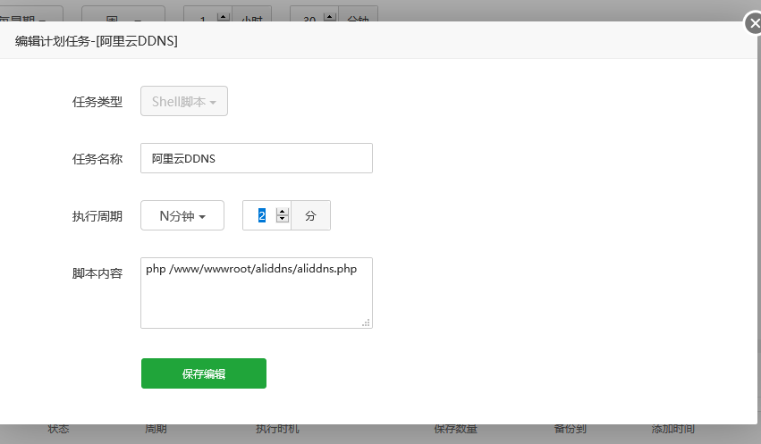
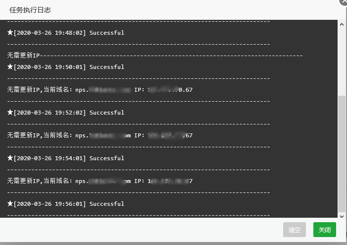
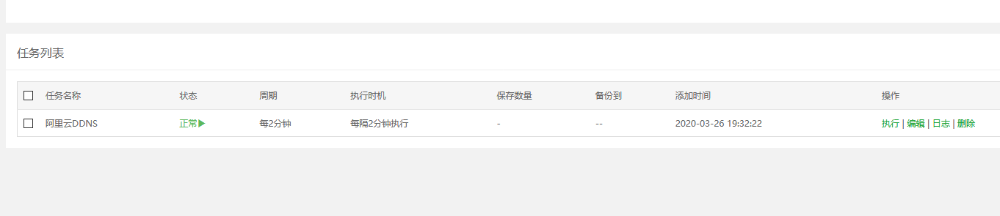

# ALIDDNS & PHP 

### 1.申请阿里云AccessKey
从[https://ak-console.aliyun.com/#/accesskey](https://ak-console.aliyun.com/#/accesskey) 申请即可，\<key>参数对应AccessKeyId，\<secret>对应AccessKeySecret
### 2.使用方法
$accessKeyId = "";
$accessKeySecret = "";
请替换自己阿里云的ID和secret

### 3.说明
参数 $domain  主域名
参数 $subdomain   二级域名
updatedomain($domain, $subdomain);

### 4.宝塔截图

